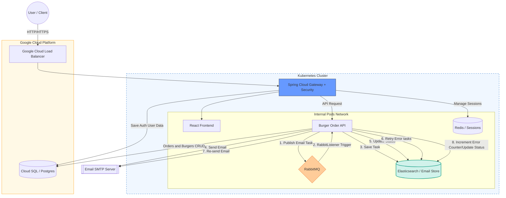

### **Звіт про виконання завдання: Cloud Deployment & Security**

**Посилання на сервіс:** [http://34.65.82.241.nip.io/order](http://34.65.82.241.nip.io/order)

_(Вхід доступний через будь-який Google-акаунт)_

### **Архітектура системи**

Система розгорнута в **Google Cloud Platform (GCP)** на базі кластера **Kubernetes (GKE)**.

### **Використані сервіси та технології**

1. **Google Cloud Infrastructure:** Google Kubernetes Engine (GKE), Google Cloud SQL (PostgreSQL).
2. **Spring Security and Spring Gateway:** Spring Cloud Gateway + Spring Security (OAuth2/OIDC через Google).
3. **State Management:**
   - **Postgres (Cloud SQL):** Зберігання даних зареєстрованних користувачів та бізнес-логіки (замовлення на бургери).
   - **Redis:** Зберігання актуальних сесій користувачів.

4. **Async Processing:**
   - **RabbitMQ:** Черга для асинхронної обробки email-сповіщень.
   - **Elasticsearch:** Використовується як сховище email-сповіщень.

5. **CI/CD:** GitHub Actions для кожного репозиторію. Автоматизована збірка Docker-образів, пуш у Google Artifact Registry та деплой у кластер за допомогою K8s маніфестів.

---

### **Посилання на репозиторії**

- **Gateway & Security (Новий):** [burger-gateway-api](https://github.com/IlliaFransua/burger-gateway-api) — центральна точка входу, OAuth2 авторизація, CORS та CSRF захист.
- **Burger Order API (Змінено):** [burger-order-api](https://github.com/IlliaFransua/burger-order-api) — додано CI/CD, інтеграція з RabbitMQ, Elasticsearch та логіка Retry для Email.
- **Frontend (Змінено):** [burger-order-ui](https://github.com/IlliaFransua/burger-order-ui) — додано Dockerfile та nginx.conf, GitHub Actions, інтеграція з Gateway через кастомний `apiClient` з підтримкою CSRF токенів.
- **K8s Manifests:** [Усі маніфести кластера](https://github.com/IlliaFransua/burger-gateway-api/tree/main/k8s).

---

### **Особливості реалізації**

- **Security:** Реалізовано повноцінний CSRF захист (`XSRF-TOKEN`, `X-XSRF-TOKEN`). Фронтенд автоматично обробляє куки та хедери через налаштований клієнт.
- **Reliability:** Реалізовано механізм повторної відправки імейлів. Якщо відправка не вийшла, система робить до 5 спроб кожні 5 хвилин, використовуючи Elasticsearch для відстеження стану.
- **Optimization:** Для ефективного використання ресурсів кластера, архітектура була оптимізована: Node.js мікросервіс із MongoDB було вилучено, оскільки він не використовувався фронтендом, що дозволило звільнити пам'ять для стабільної роботи основних Java та інших сервисів.
